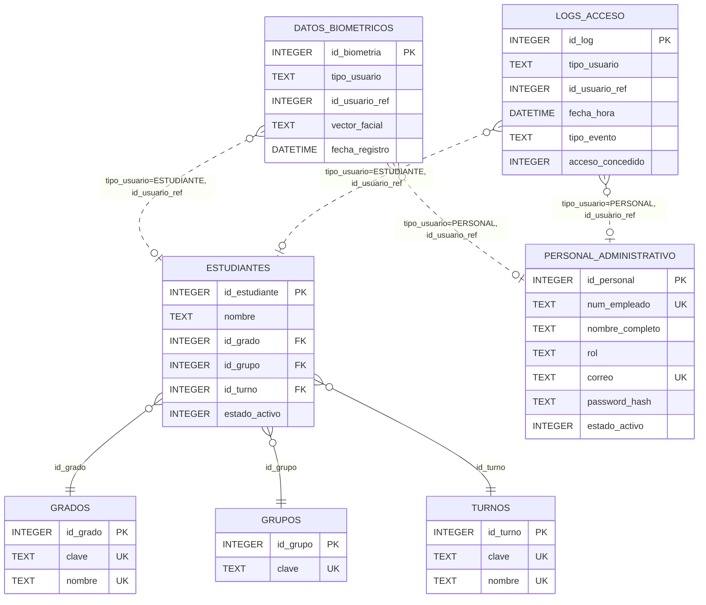

# Diagrama Relacional de la Base de Datos

Este diagrama representa el esquema definido en `database/script.sql`.

## Notas

- Relaciones fuertes (con `FOREIGN KEY`): `estudiantes` con `grados`, `grupos` y `turnos`.
- Relaciones de `datos_biometricos` y `logs_acceso` son polimorficas por diseno (`tipo_usuario` + `id_usuario_ref`), sin FK declarada en SQLite.
- Vistas de apoyo (no incluidas como entidades): `vw_estudiantes`, `vw_logs_acceso`, `vw_intentos_fallidos`.
