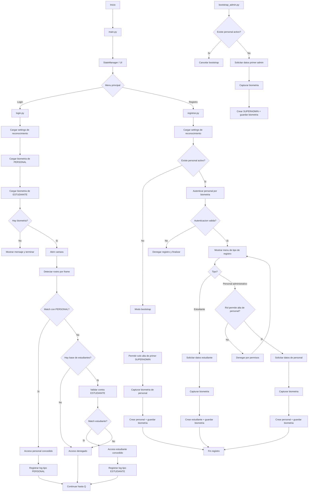

# Flujo de la App (Face Recognition)

Este diagrama resume el flujo principal de ejecucion y las decisiones clave del sistema.

## Notas rapidas

- En login, PERSONAL siempre se valida antes de ESTUDIANTE.
- En registro, primero se autentica personal administrativo.
- Si no existe personal activo, se habilita bootstrap para crear el primer SUPERADMIN.
- Los accesos se registran en `logs_acceso` con `tipo_usuario` correspondiente.
